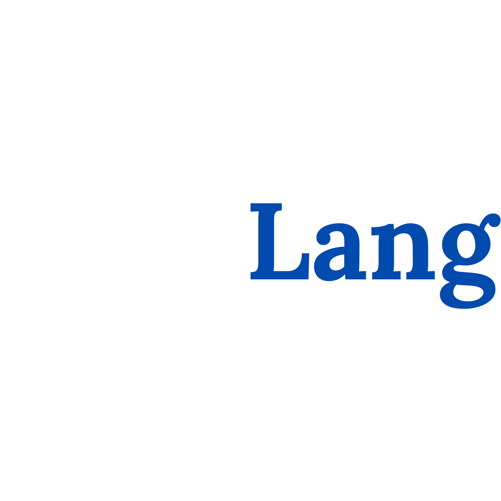

<div align="center">



[](#)
[](#)
[](#)

*Write Less Get More. Say exactly what you mean. Max 4 characters.*

</div>

---

<div align="center">
  
**dryLang** is a dynamically-typed bytecode virtual machine born out of a very specific, slightly embarrassing personal realization.

<br/>
<br/>


</div>

<br/>

## Behind

In my past, I wrote a 20-paragraph text message just to apologize to my ex. Looking back, I realized something important: text is just virtual. It lacks real-life emotional reaction, and spending 20 paragraphs just to say "I'm sorry" was incredibly verbose and pointless. 

It made me think: *Why do we beat around the bush so much?* 

Inspired by that moment—and heavily influenced by legendary local parody projects like [Jaksel Script](https://github.com/willysel/jaksel-language), [Prabogo](https://github.com/conquera99/prabogo), [gib.run](https://gib.run/), and [Naskah Script](https://github.com/khalidomard/naskahscript)—I decided to create a programming language that strictly forbids you from being verbose. 

In **dryLang**, no syntax or keyword exceeds 4 characters. You say exactly what you mean, and nothing more. It's truly a Frankenstein of the languages I've touched before, combining their best concepts into a single, stripped-down experience:

- **Java**: Inheritance and modular file structures.
- **JavaScript**: String interpolation (`${}`).
- **Python**: Clean variable declarations, `print` (`pt`), and `input` (`in`).
- **Go**: Strict rules (unused variables will stop compilation).
- **Go & C++**: Struct foundations.

## Quick Examples

**1. Basic I/O & Interpolation**
```rust
name = in("What is your name? ")
pt("Hello, ${name}!")
```

**2. Structs**
```rust
User {
    name
    age
}
```

**3. HTTP Server**
A fully functional HTTP server in just 4 lines:
```rust
fn handler(req) {
    rev "hello, world!"
}
op(8080, handler, "mul", 100)
```

## Installing

dryLang is a single binary with zero external dependencies.

**From source:**
```bash
git clone https://github.com/zakyislm/drylang.git
cd drylang
go build -o dry .
```

## Disclaimer

This is purely a project made for fun and for learning how to build a compiler/interpreter. 

It is absolutely not meant for production. If you use this to build your company's banking system, you are on your own. But if you want to play around with a strict, minimalist language just for the vibes, you're in the right place.

## Documentation
Visit [Docs here](https://drylang.jeki.me/docs) to view the full documentation.

## Contributing

We welcome contributions! Please see our [Contributing Guide](CONTRIBUTING.md) for more details.

## License

dryLang is released under the [MIT License](LICENSE).